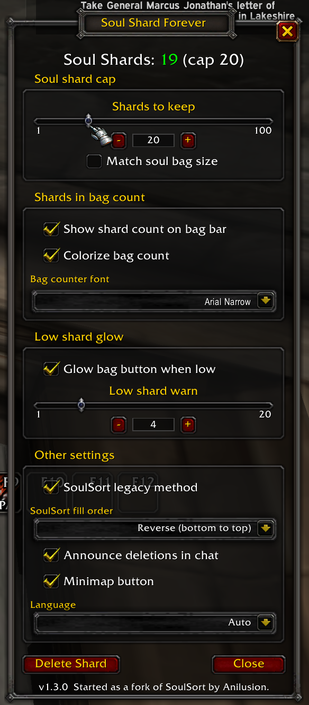

# Soul Shard Forever (SSF)

This is a Warlock class addon that can delete Soul Shards from bags over a specified cap. It also can warn when running low. It can display on your left bag how many shards are in inventory and can color code that number. It can also glow the bag if you are below your minimum on-hand count. Almost all of these options are toggleable.

Why did I write it? I used Soul Sort for 10 or more years and it's not ported to Forever. There are a handful of addons that do all this, but they tend to be hard to configure or have features not related to the task at hand, deleting soul shards and warning you when low.

This is for Forever only, I will not backport it because the original works well. On Classic Era use [SoulSort](https://www.curseforge.com/wow/addons/soulsort-easy-soul-shard-management) by Anilusion, which is the addon SSF started from.

<a href="media/01_window_green.png"></a>

## Using it

The game lets an addon destroy one item per keypress, and none in combat. SSF deletes one shard per event, but only when you're over the cap, and it does nothing while you're fighting. Call it however you like:

- **A key.** Escape > Options > Key Bindings > Soul Shard Forever > Delete Shard. Bind anything.
- **From chat.** `/ssf delete`
- **A macro.** On the line before an ability you spam. Every press trims one shard when you're over the cap.

  ```
  #showtooltip
  /ssf delete
  /cast Life Tap
  ```

  ```
  #showtooltip
  /ssf delete
  /cast Bane of Agony
  ```

- **The Delete Shard button** in the GUI window.

Shards in regular bags go first; a soul bag stays full. (Soul bag support to be added when I actually get one in Forever.)

- **Shards to keep** is the cap, 1 to 100. Use the slider or use the − and + to fine tune.
- **Match soul bag size** ties the cap to your soul bag's slot count while one is equipped. (Coming real soon.)
- **Show shard count on bag bar** puts the number on your far-left bag. Green in range, yellow over the cap, red when you're low. Pick the font, or turn the colors off.
- **Glow bag button when low** lights the bag button while you're under the low mark, so you remember to farm before you need them.
- **Low shard warn** is the number of shards to activate the warning glow. 1 to 20. Same slider and − and + as the cap.
- **Announce deletions in chat** is off by default, turn on if you want to see that or for addons that watch chat (like MSBT).

The minimap button opens the window; its tooltip shows the count and the cap. Settings are per character.

## Commands

| Command | What it does |
|---|---|
| `/ssf` | Count, cap, and this list |
| `/ssf delete` | Delete one shard if over the cap |
| `/ssf setmax N` | Set the cap; naked shows cap |
| `/ssf announce on/off` | Chat line per deletion; naked shows status |
| `/ssf options` | Opens the GUI window (`/ssf settings` does as well) |

Tab autocompletes the SSF commands in chat (try it, I hate typing). `/click SSFDelete` does the same as `/ssf delete` (for keybind addons that can't run slash commands).

## License

MIT, see [LICENSE](LICENSE). Started as a fork of SoulSort by Anilusion, rewritten from scratch; no original code remains.

Bundles Ace3, LibDBIcon, LibSharedMedia and LibCustomGlow (BSD-style and MIT), LibDataBroker and LibStub. Each keeps its own license.
